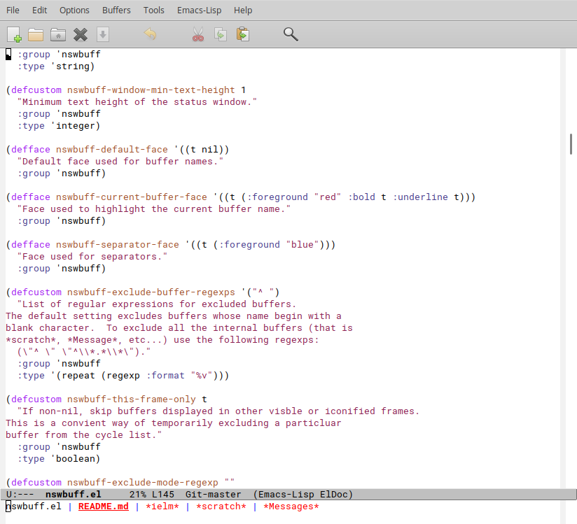
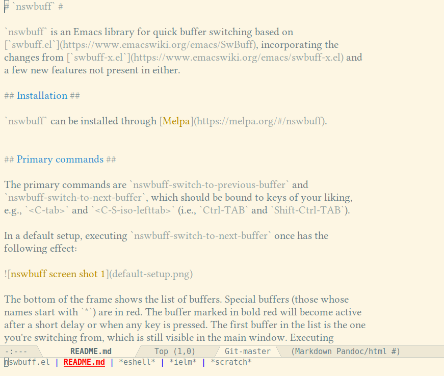

# `nswbuff` #

`nswbuff` is an Emacs library for quick buffer switching based on [`swbuff.el`](https://www.emacswiki.org/emacs/SwBuff), incorporating the changes from [`swbuff-x.el`](https://www.emacswiki.org/emacs/swbuff-x.el) and a few new features not present in either.

## Installation ##

`nswbuff` can be installed through [Melpa](https://melpa.org/#/nswbuff).

## Primary commands ##

The primary commands are `nswbuff-switch-to-previous-buffer` and `nswbuff-switch-to-next-buffer`, which should be bound to keys of your liking, e.g., `<C-tab>` and `<C-S-iso-lefttab>` (i.e., `Ctrl-TAB` and `Shift-Ctrl-TAB`).

In a default setup, executing `nswbuff-switch-to-next-buffer` once has the following effect:

This screen shot shows a buffer switch from `nswbuff.el` to `README.md`. The bottom of the frame shows the list of buffers. Special buffers (those whose names start with `*`) are in red. The bold red, underlined buffer will become active when buffer switching ends. The first buffer in the list is the one you're switching from, which is still visible in the main window. Executing `nswbuff-switch-to-next-buffer` again will highlight the next buffer in the list (`*scratch*` in the screen shot).

Buffer switching ends automatically after a short delay, or when you press any key (other than the keys bound to `nswbuff-switch-to-next-buffer` and `nswbuff-switch-to-previous-buffer`, obviously). By default, during buffer switching, the initial buffer remains visible until buffer switching ends. If you wish to make the intermediate buffers visible during cycling, you can set the option `nswbuff-display-intermediate-buffers` to `t`:

This screen shot shows the same buffer switch, from `nswbuff.el` to `README.md`, but this time the `README.md` buffer is shown during switching. Executing `nswbuff-switch-to-next-buffer` would show the `*scratch*` buffer. Note that the screen shot also shows that the face and colors used for displaying the buffer names are fully customizable.

## Customizing the buffer list ##

The buffers that `nswbuff` offers for cycling are essentially the buffers returned by the function `buffer-list`. There are a few options to customize this list, however. First, you can exclude buffers with `nswbuff-exclude-buffer-regexps`. Any buffer whose name matches one of the regexps in this list is not switchable. The default setting excludes buffers whose name begin with a blank character.  To exclude all the internal buffers (that is `*scratch*`, `*Message*`, etc...) you could use the following regexps `'("^ .*" "^\\*.*\\*")`.

Buffers can also be excluded based on their major mode through the option `nswbuff-exclude-mode-regexps`. These regexps are matched against the `symbol-name` of the buffer's major mode.

Buffers that match one of these options but should be included anyway can be matched using the option `nswbuff-include-buffer-regexps`. Any buffer matching one of the regexps in this list is included, regardless of whether they also match an exclude regexp. Obviously, the same effect can also be obtained by using more specialized exclude regexps, but using an include regexp is usually easier to understand and less error-prone.

Another option for customizing the list of switchable buffers is `nswbuff-buffer-list-function`. This can be set to a function that returns a list of buffers, making only those buffers switchable instead of all buffers returned by `buffer-list`. If the function in `nswbuff-buffer-list-function` returns `nil`, `nswbuff` falls back to the buffers returned by `buffer-list`.

Note that the list of buffers returned by the function in `nswbuff-buffer-list-function` is still matched against `nswbuff-exclude-buffer-regexps`, `nswbuff-exclude-mode-regexps` and `nswbuff-include-buffer-regexps`, so set (or keep) these to `nil` if you don't want this.

Lastly, buffers can be excluded through a buffer-local variable `nswbuff-exclude`. This variable can be set to `t` in a file-local variable block or in a `.dir-locals.el` file to exclude specific files from switching that cannot be easily captured in another way. For example, if you want to exclude certain Org files (e.g., the agenda files) from the buffer list without excluding all Org files, you could use this method.

## Further Customization ##

Quite a few aspects of `nswbuff` can be customized in addition to the ones already mentioned. See the customization group `nswbuff` for details.

## Projectile ##

`nswbuff` provides some very simple but nifty integration with [Projectile](http://batsov.com/projectile). If you set `nswbuff-buffer-list-function` to `nswbuff-projectile-buffer-list`, only the buffers belonging to the current Projectile project are offered for switching.  This makes for a very light-weight (but in my opinion effective) alternative to such modes as [`perspective.el`](https://github.com/nex3/perspective-el) or [`persp-mode`](https://github.com/Bad-ptr/persp-mode.el). Switching buffers with `nswbuff` keeps you in the project, any other buffer-switching method (`C-x b`, ivy, helm, or what have you) is not affected and can thus be used to move out of the project.

Note that `nswbuff-projectile-buffer-list` has another property: if you're in a project, it adds any buffers in `buffer-list` whose name matches `nswbuff-include-buffer-regexps` to the list of buffers it returns. Since this option is normally `nil`, it has no effect, but if you set it to, e.g., `'("\\*scratch\\*")`, the `*scratch*` buffer is offered for switching even when you're in a project. This, too, moves you out of the project, of course.

## `golden-ratio` / `zoom` ##

Packages such as [zoom](https://github.com/cyrus-and/zoom) and [golden-ratio](https://github.com/roman/golden-ratio.el) automatically resize windows to ensure that the active window always has a certain minimum size. There is no point in resizing the buffer switching window, however, so in order to prevent that from happening, you should add the name of the `nswbuff` status buffer to `golden-ratio-exclude-buffer-names` or `zoom-ignored-buffer-names`. This name defaults to `" *nswbuff*"` (without the double quotes; note the initial space).

